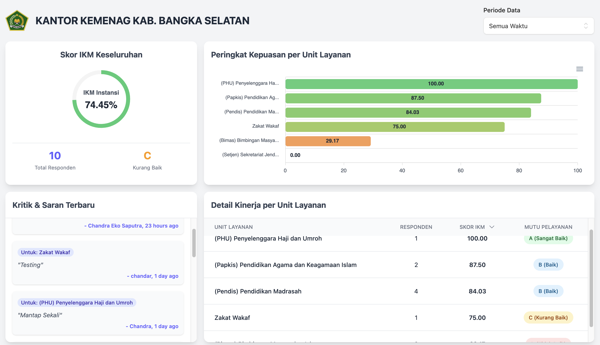

# IKM-Apps: Sistem Survei Kepuasan Masyarakat Real-Time


**IKM-Apps** adalah aplikasi web modern yang dirancang untuk mengelola dan menganalisis **Survei Kepuasan Masyarakat (SKM)** secara digital, interaktif, dan *real-time*. Dibangun di atas TALL Stack (Tailwind, Alpine.js, Laravel, Livewire), aplikasi ini menyediakan dasbor analitik dan mode tampilan publik ("Mode TV") yang dinamis.

[Gambar Screenshot Dasbor Mode TV]


## ✨ Fitur Utama

Aplikasi ini terbagi menjadi dua bagian utama: halaman publik untuk pengisian survei dan dasbor admin untuk manajemen penuh.

### 🏛️ Halaman Publik & Responden
- **Formulir Survei Dinamis**: Antarmuka pengisian survei yang bersih dan responsif.
- **Integrasi QR Code**: Responden dapat memindai QR code untuk langsung mengisi survei untuk unit layanan tertentu, dengan kolom yang sudah terkunci.
- **Dasbor Publik "Mode TV"**: Tampilan *fullscreen* yang dirancang untuk layar besar, menampilkan skor IKM, peringkat, dan ulasan terbaru secara *real-time* dengan *auto-scroll*.

### 🔒 Dasbor Admin
- **Dasbor Analitik Interaktif**: Visualisasi data IKM keseluruhan, peringkat unit layanan, dan data demografi dengan *chart* (Gauge & Bar) yang ditenagai ApexCharts.
- **Manajemen Data Master**: CRUD penuh untuk Unit Layanan (Satker) dan Kuesioner Survei.
- **Laporan Kritik & Saran**: Halaman khusus untuk meninjau semua masukan kualitatif dari responden, lengkap dengan filter berdasarkan waktu dan unit layanan.
- **Ekspor Laporan ke PDF**: Fitur ekspor data yang efisien, membuat PDF langsung di sisi klien (*client-side*) untuk menghindari beban server, bahkan dengan data dalam jumlah besar.
- **Generator QR Code**: Admin dapat membuat dan mengunduh QR code untuk setiap unit layanan atau untuk survei global langsung dari dasbor.
- **Navigasi SPA**: Pengalaman pengguna yang sangat cepat di dalam dasbor admin berkat `wire:navigate` dari Livewire 3.
- **Pembaruan Real-time**: Dasbor publik dapat diperbarui secara otomatis saat survei baru masuk menggunakan Laravel Reverb.

---

## 🚀 Teknologi yang Digunakan

- **Backend**: Laravel 12
- **Frontend**: Livewire 3 & Alpine.js
- **Styling**: Tailwind CSS V4 & Flux UI Starter Pack
- **Real-time Engine**: Laravel Reverb
- **Charts**: ApexCharts.js
- **PDF & QR Code Generation**: jsPDF & qrcode.js (Client-side)
- **Database**: MySQL / PostgreSQL

---

## ⚙️ Instalasi

Untuk menjalankan proyek ini secara lokal, ikuti langkah-langkah berikut:

1.  **Clone repositori:**
    ```bash
    git clone [https://github.com/chandraes/ikm-kemenag-basel](https://github.com/chandraes/ikm-kemenag-basel)
    cd NAMA_REPO_ANDA
    ```

2.  **Instal dependensi PHP:**
    ```bash
    composer install
    ```

3.  **Siapkan file environment:**
    ```bash
    cp .env.example .env
    php artisan key:generate
    ```

4.  **Konfigurasi `.env`:**
    Sesuaikan koneksi database (`DB_*`) dan kredensial Reverb (`VITE_REVERB_*`) Anda.

5.  **Jalankan migrasi dan seeder database:**
    ```bash
    php artisan migrate --seed
    ```

6.  **Instal dependensi JavaScript:**
    ```bash
    npm install
    ```

7.  **Build aset frontend:**
    ```bash
    npm run build
    ```

8.  **Jalankan server Reverb (di terminal terpisah):**
    ```bash
    php artisan reverb:start
    ```

9.  **Jalankan server development (di terminal lain):**
    ```bash
    composer run dev
    ```

10. **Akses aplikasi** di `http://127.0.0.1:8000`.

---

## 📄 Lisensi

Proyek ini dilisensikan di bawah **MIT License**. Lihat file `LICENSE` untuk detail lebih lanjut.
